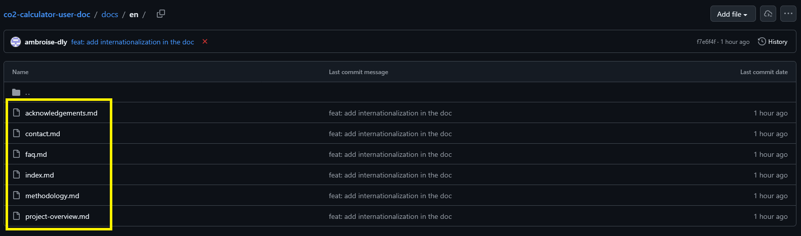
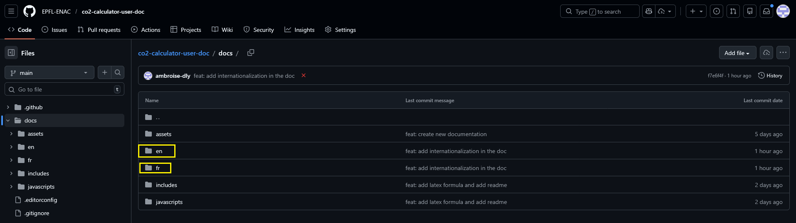
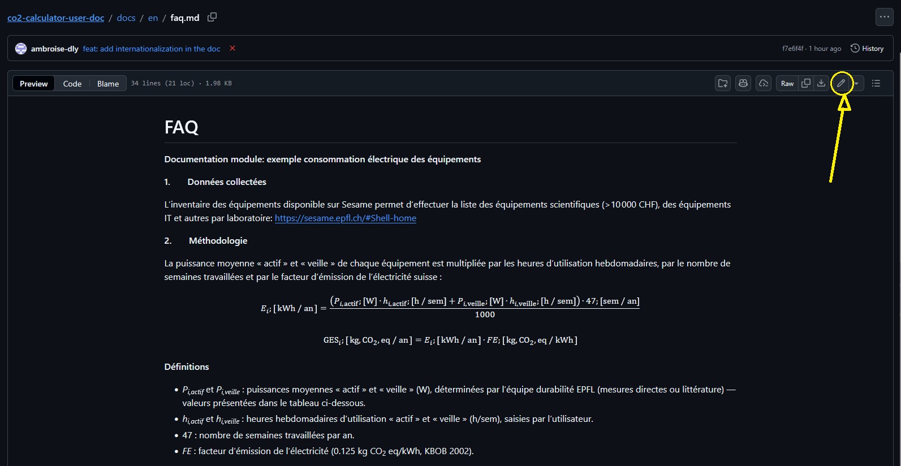
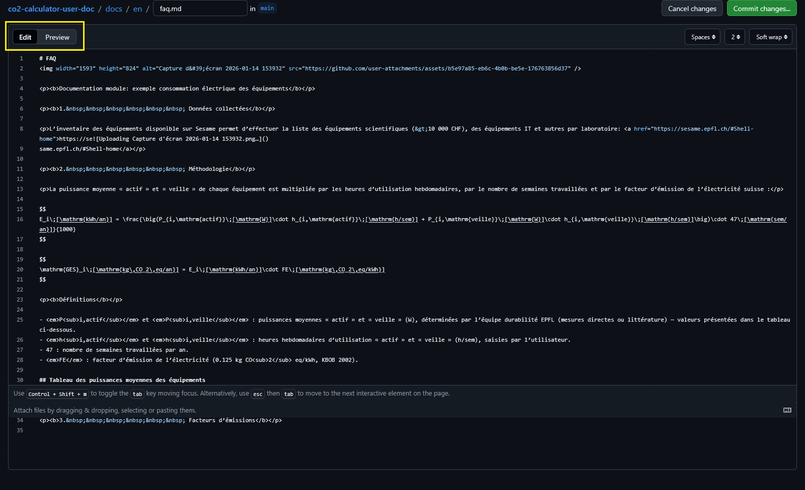
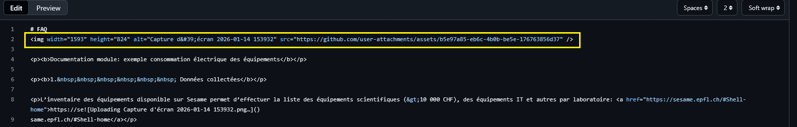
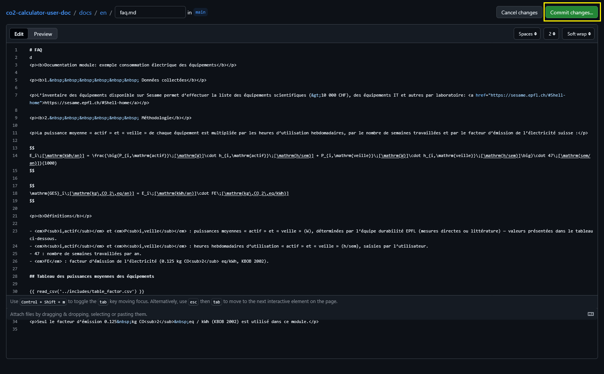
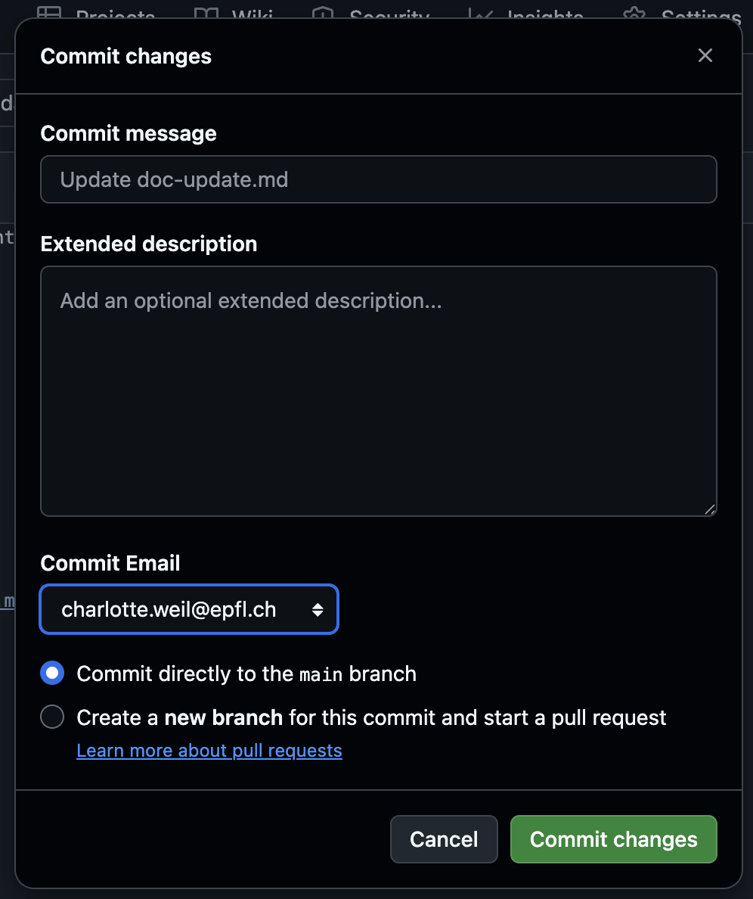

## How to update texts in documentation
To update texts in the documentation, first goes to the link of the wanted documentation through backoffice Documentation-editing section.

## 1. Select the the right documentation files 


Each .md file corresponds to a documentation page. 

### 1.1 Select the right documentation page in user documentation 
*For internationalisation*
First choose the language of the documentation page you want to edit in the user documentation.

Each .md file corresponds to a documentation page in the selected language. Be careful to modify both language files if needed.

## 2. Edit text button
Click on top right "Edit this page" button to edit the text of the documentation page.


## 3. Make your changes
You can now edit the text in markdown format as needed. DOnt hesitate to switch to preview mode to see how the changes will look like.


### 3.1 Adding Images
To add image you can simply drag and drop the image from your computer to the text editor where you want to add it.
This will automatically upload the image to the repository and insert the correct markdown syntax to display the image as follows:


### 3.2 Adding Links
To add a link, use the following syntax:
```
[Link Text](URL)
``` 

### 3.3 Adding Equations

To add an inline equation, use single dollar signs `$...$`. For block equations, use double dollar signs `$$...$$`. ANd then writes your LaTeX code between the dollar signs.

Example inline: `$E=mc^2$` render as: $E=mc^2$ .

Example block: 
```
$$ 
E=mc^2 
$$
```
render as: 

$$ 
E=mc^2 
$$

### 3.4 Adding Tables
To add a table, use the following markdown syntax:
```
| Header 1 | Header 2 |
|----------|----------| 
| Cell 1   | Cell 2   |
```
render as :

| Header 1 | Header 2 |
|----------|----------| 
| Cell 1   | Cell 2   |

Refers to [Markdown Table Syntax](https://www.markdownguide.org/extended-syntax/#tables) for more details.
## 4. Commit changes




## 5. Make a commit message
Courte description ds changements apportés (où, quoi), ajouter une description si besoin. Et créez une nouvelle branche avec la syntax `text/<edited_files>`



## 6. When to do the PR
Vous arriverez ensuite sur `Open a Pull Request`
- Mettez un titre, vous pouvez ajouter une description ou laisser vide, ou laisser le template.
- Mettez @charlottegiseleweil  comme reviewer en haut à droite
- Créer la Pull Request en bas à droite

