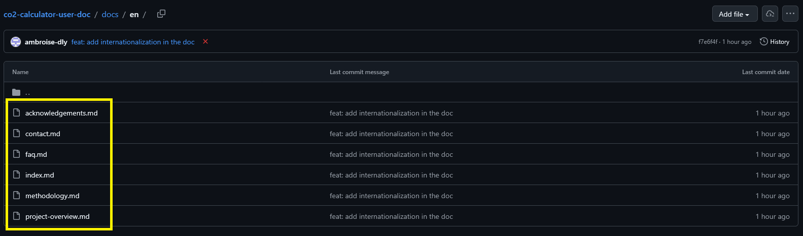
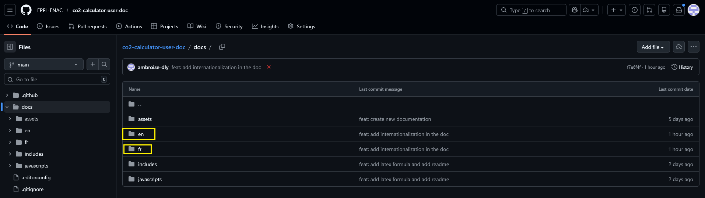
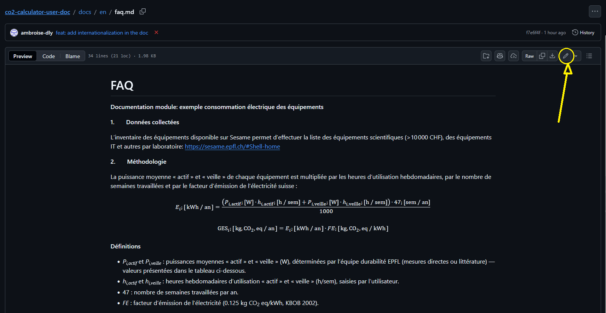
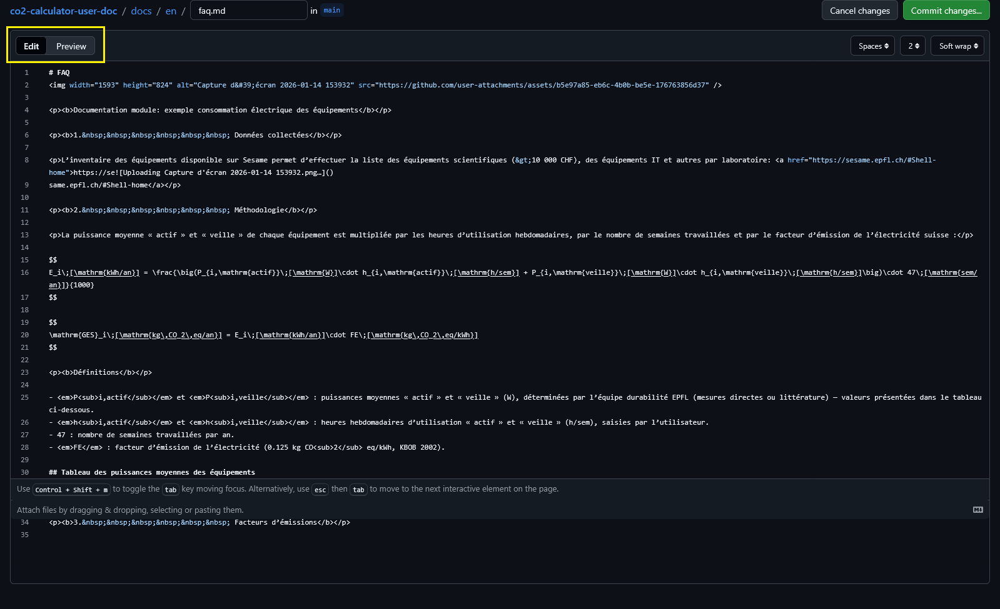
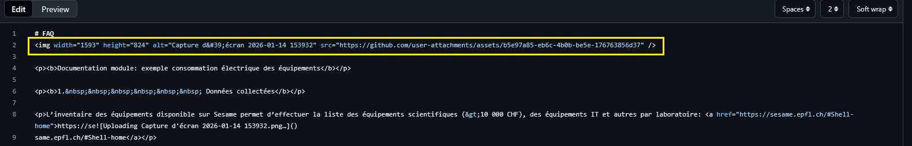
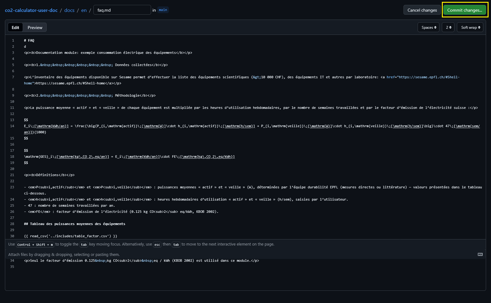

## How to update texts in documentation
To update texts in the documentation, first goes to the link of the wanted documentation through backoffice Documentation-editing section.

## 1. Select the the right documentation files 


Each .md file corresponds to a documentation page. 

### 1.1 Select the right documentation page in user documentation 
*For internationalisation*
First choose the language of the documentation page you want to edit in the user documentation.

Each .md file corresponds to a documentation page in the selected language. Be careful to modify both language files if needed.

/!\ Make sure to make your changes in all languages ! (One file must be changed by language). 

## 2. Edit text button
Click on top right "Edit this page" button to edit the text of the documentation page.


## 3. Make your changes
You can now edit the text in markdown format as needed. DOnt hesitate to switch to preview mode to see how the changes will look like.


### 3.1 Syntax
The syntax used in the calculator is the [Markdown syntax](https://www.markdownguide.org/basic-syntax/)

### 3.2 Adding Images
To add image you can simply drag and drop the image from your computer to the text editor where you want to add it.
This will automatically upload the image to the repository and insert the correct markdown syntax to display the image as follows:


### 3.3 Adding Links
To add a link, use the following syntax:
```
[Link Text](URL)
``` 

### 3.4 Adding Equations

To add an inline equation, use single dollar signs `$...$`. For block equations, use double dollar signs `$$...$$`. ANd then writes your LaTeX code between the dollar signs.

Example inline: `$E=mc^2$` render as: $E=mc^2$ .

Example block: 
```
$$ 
E=mc^2 
$$
```
render as: 

$$ 
E=mc^2 
$$

> [!Caution]
> If equation is not properly display in preview mode: Add a an empty after second dollars '$$' 

### 3.5 Adding Tables
To add a table, use the following markdown syntax:
```
| Header 1 | Header 2 |
|----------|----------| 
| Cell 1   | Cell 2   |
```
render as :

| Header 1 | Header 2 |
|----------|----------| 
| Cell 1   | Cell 2   |

Refers to [Markdown Table Syntax](https://www.markdownguide.org/extended-syntax/#tables) for more details.
## 4. Commit changes




## 5. Commit
Write a commit message, and you can directly "Push to main" by pressing "Commit". 


Your changes will be visible after a few minutes. 
